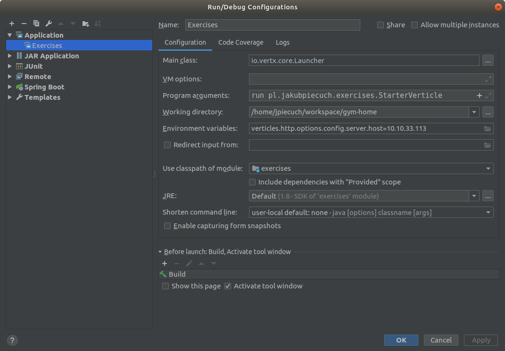

= Exercises - module responsible for providing exercises

== Build ==

----
mvn clean package
----

== Run ==

----
cd target
java -jar exercises-0.0.1-SNAPSHOT.jar
----

== Run from Intellij IDEA ==

== App configuration ==

Reading: link:https://vertx.io/docs/vertx-config/java/[]

----
resources/application.json
----

== Architecture ==
- StarterVerticle
* Pulls configuration
* Attempts to deploy verticles defined in configuration (http, service)
* Success when all vertciles were deployed
* Fail when at least one verticle couldn't be deployed or configuration couldn't be obtained

- HttpVerticle (Reading: link:https://vertx.io/docs/vertx-web/java/[])
* Creates HTTP server
* Registers two endpoints (/exercises, /health)
* Injects proxy to send requests for exercises details via event bus (ExerciseHandlerImpl.java - constructor)

- ServiceVerticle (Reading: link:https://vertx.io/docs/vertx-service-proxy/java/[]
* Registers service on event bus (ExercisesServiceImpl.java - constructor)
* Handles events which requests exercises details (ExercisesServiceImpl - exercises method)
* @ProxyGen (on ExercisesService.java interface)
** Creates proxy to hide actual communication with event bus (ExercisesServiceVertxEBProxy.java - lines 74-79)
** Creates proxy handler responsible for calling proxy when request occurs (ExercisesServiceVertxProxyHandler - method handle)
* @VertxGen
** Creates class pl.jakubpiecuch.exercises.service.reactivex.ExercisesService which expose "reactive API".
Inside it calls proxy (lines 71-73)

== TODO ==
. Create next Verticle (possibly RepositoryVerticle)

- Extend AbstractVerticle
- Create Repository implementation (probably very similar to ExercisesServiceImpl as it will serve exercises details)
- Register Repository as consumer on event bus
** TIP: in repository constructor call this.vertx.eventBus().consumer(...),
** you have to set name and configure reply on event which will come to consumer,
be careful as you have to send message as JSON string because only then it can be successfully used by service,
** TIP: second argument in consumer method could be written as lambda)
- Change implementation of method exercises in ExercisesServiceImpl
** from now on it should send request to event bus on address specified in repository consumer
** TIP: in exercises method call this.vertx.eventBus().send(...), the one with 3 argument and handler as last argument, handler can be lamda
** handler should take received message and based on it create Page object
- Have it? Run and test
- Doesn't work? Ups ;-)
- Try again.

. Utilize @ProxyGen annotation
- Create interface for Repository implementation and add @ProxyGen annotation on it
- Register proxy service for Repository,
** TIP: very similar to ExercisesServiceImpl (ProxyHelper)
- Expose method to handle requests for exercises details
** TIP: Again very similar to method exercises in ExercisesServiceImpl
- Tell Vert.x that you add another module for code generation
** TIP: package-info.java
** TIP: you don't have to do this if your repository interface in in package or subpackage wher package-info.java already exists
- Change implementation of method exercises in ExercisesServceImpl
** from now on it should send request via repository proxy for exercises details
** first of all create repository proxy,
** TIP: check constructor of ExerciseHandlerImpl, only interested in ProxyHelper.createProxy,
result of createProxy should be assigned to private field as it will be instance of repository proxy
** in method exercises make a call to method exercises from repository proxy (handler -> lambada ;-) )
** remember that you have to handle handler of service method inside repository handler
** TIP: Future.successFuture, Future.failedFuture
- Try this bad boy!
- Stupid code...
- Don't worry

. Switch handlers with RxJava
- Add annotation @VertxGen on repository interface
** TIP: mvn clean package, for safety as it has to generate class with reactive method
- Change implementation of ExercisesServiceImpl
** instantiate repository reactivex class (in my case ....repository.reactivex.ExercisesRepository)
** TIP: Check constructor of ExerciseHandlerImpl
** in method exercises call rxExercises of reactivex class
** TIP: remember to call subscribe on rxExercises and implement onSuccess and onError where you will handle input handler
- It's time! It'll work!
- OK, not this time...
- "I don't loose, I learn" - Michael Jordan